# Berkeley Networking Tracker

**Live app: <https://berkeley-networking-tracker-shuoran.vercel.app>**

A private contact tracker for the people you want to stay connected with at Berkeley. Sign up,
and you get your own list: add someone you met, record where you met them and what you talked
about, mark how urgent it is to follow up, then sort and filter later. The interesting part is
not the CRUD — it is that **ownership is enforced by Postgres, not by application code**. Every
row of `contacts` is guarded by Row Level Security policies written against `auth.user_id()`,
so one user cannot read or change another user's contacts *even by taking their own valid JWT
and calling the database API directly*, bypassing the app entirely. That claim is checked
automatically by [`npm run verify:rls`](#automated-rls-verification), whose output is
[reproduced below](#2-two-account-privacy-test-the-strong-form).

---

## Table of contents

- [Features](#features)
- [Product walkthrough](#product-walkthrough)
- [Technology stack](#technology-stack-and-why)
- [Architecture](#architecture)
- [Database schema](#database-schema)
- [Authentication and RLS ownership](#authentication-and-rls-ownership)
- [Local setup](#local-setup)
- [Environment variables](#environment-variables)
- [Testing](#testing)
- [Deployment](#deployment)
- [Grading evidence](#grading-evidence)
- [Rubric traceability](#rubric-traceability)
- [Known limitations](#known-limitations-and-what-id-do-next)

---

## Features

- **Sign up, sign in, sign out** with email and password via Neon Managed Better Auth.
- **A private contact list per user**, enforced in the database rather than the UI.
- **Add a contact** with name, company, role, where you met, notes, and priority.
- **Edit and delete** your own contacts, with a confirmation step before deleting.
- **Sort** by name, company, priority, or date added, ascending or descending.
- **Filter** by priority, and search across name and company.
- **Priority is constrained** to `high`, `medium`, or `low` in three independent places.
- **Clear validation errors** — a blank name or invalid priority fails with a message attached
  to the specific field.
- **Distinct loading, empty, success, and error states**, including different empty states for
  "no contacts yet" and "nothing matches your filters".
- **Web and mobile friendly** — a table on wide screens, stacked cards on narrow ones.
- **Data persists** in Neon Postgres and survives refreshes, new tabs, and new devices.

> **Try it:** the live app has open sign-up. Create two accounts in two private windows to
> confirm for yourself that neither can see the other's contacts.

---

## Product walkthrough

Every screenshot below was captured against the **deployed production URL** by
[`scripts/capture-evidence.mjs`](scripts/capture-evidence.mjs), which drives a real browser
through the whole product. Re-create them all with `npm run capture:evidence -- <url>`.

| Sign in | Empty state |
| --- | --- |
| 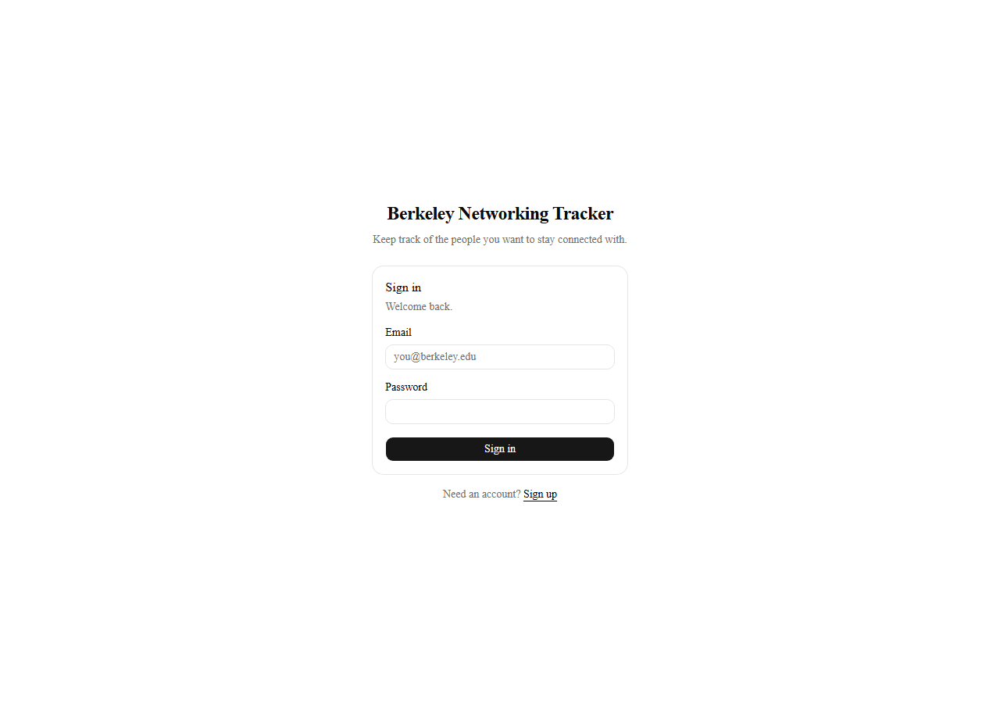 | 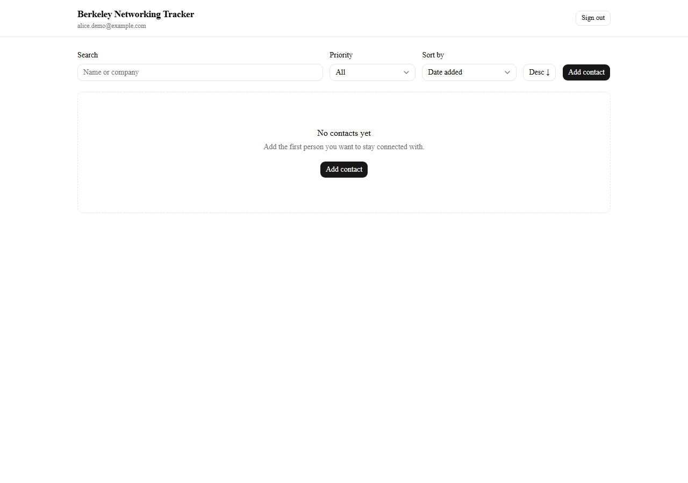 |

**The contact list** — four contacts, sortable and filterable.

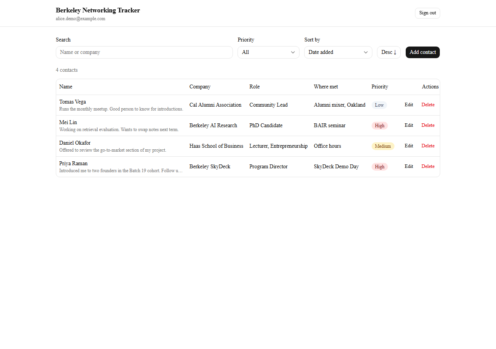

| Sorted by priority (high first) | Filtered to high priority |
| --- | --- |
| 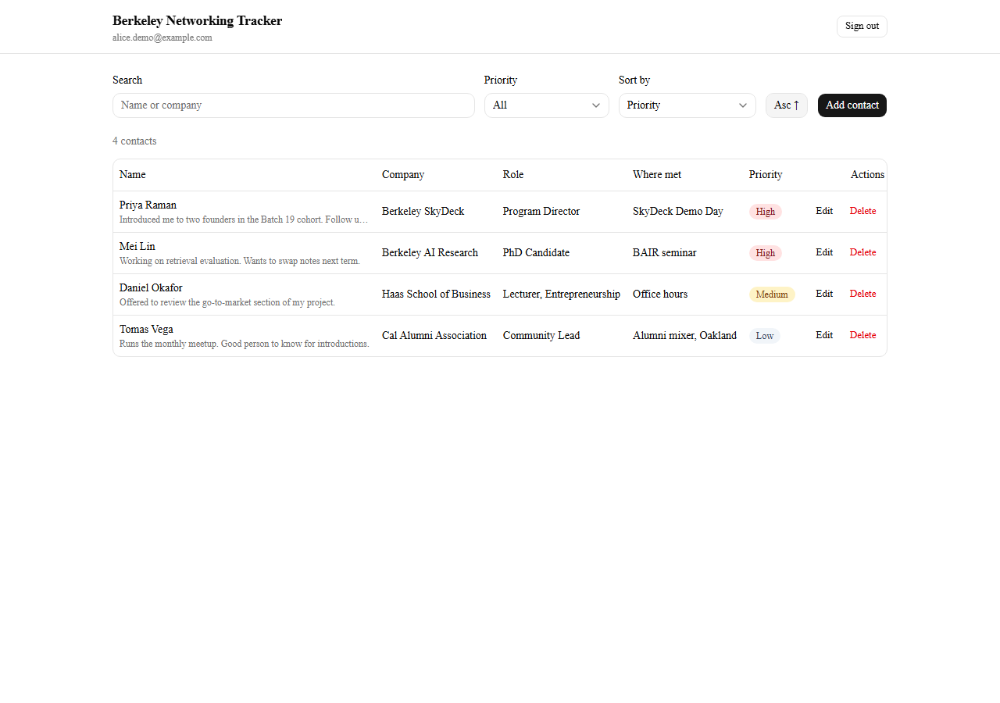 | 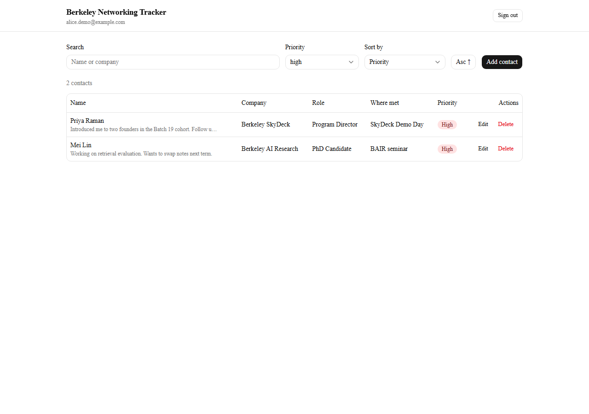 |

Sorting by priority is correct rather than alphabetical — `high, high, medium, low`, not
`high, low, medium`. See [`priority_rank`](#database-schema) for why that needs a real column.

| Editing a contact | After deleting |
| --- | --- |
| 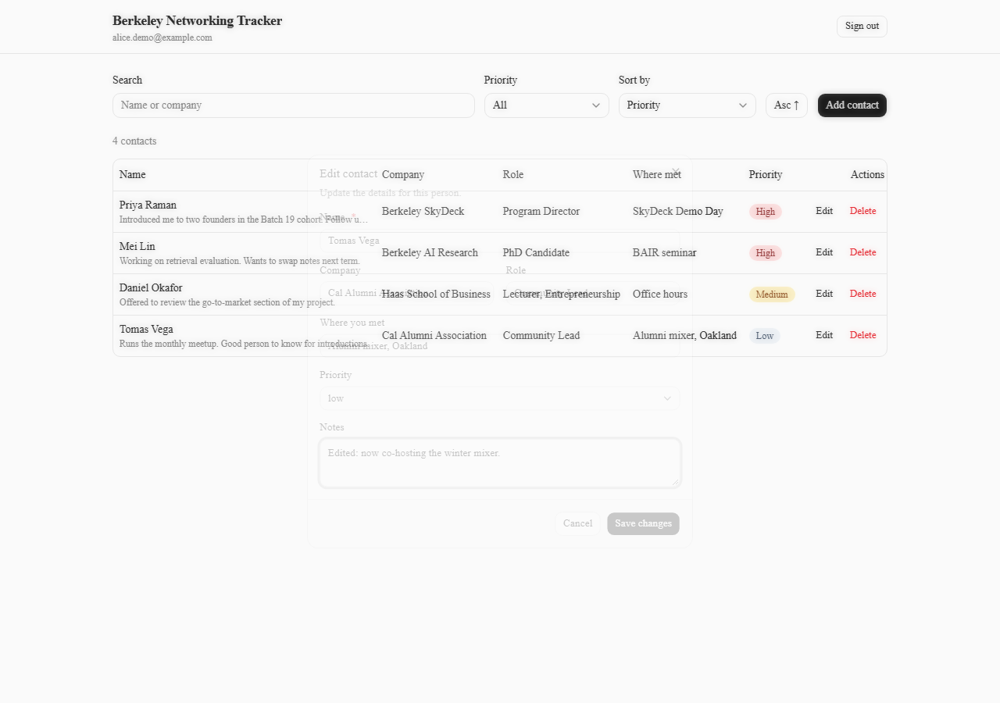 |  |

**Mobile** — the same list at 390px, as stacked cards with full-width controls.

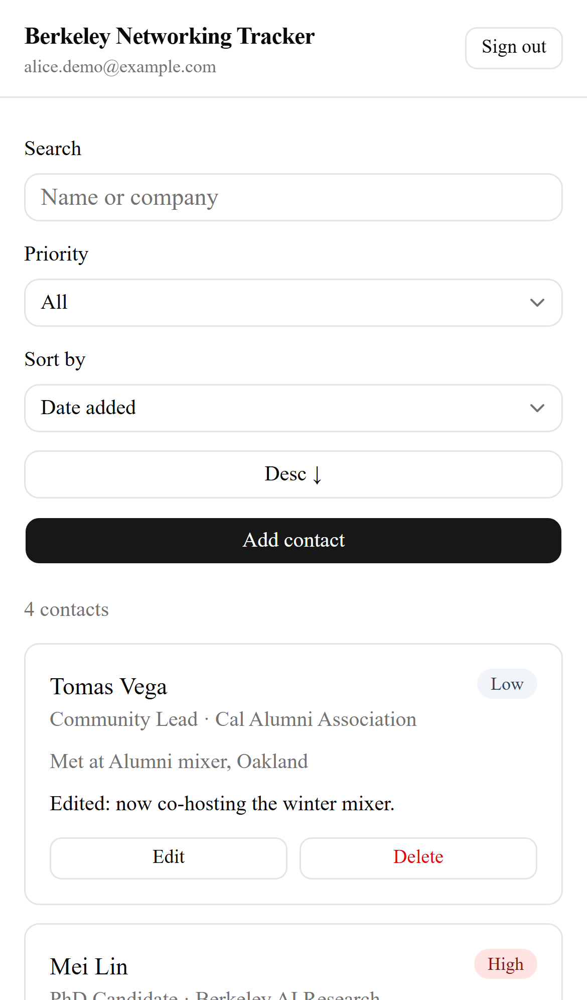

---

## Technology stack and why

| Layer | Choice | Why |
| --- | --- | --- |
| Framework | **Next.js 16** (App Router, TypeScript) | One project holds the React frontend and the server-side API routes while keeping them in genuinely separate execution contexts. Deploys to Vercel with no configuration. |
| Styling | **Tailwind CSS v4 + shadcn/ui** (Radix primitives) | A real component system rather than hand-written CSS: accessible dialogs, selects and tables, with consistent tokens. Radix handles focus trapping and keyboard behaviour I would otherwise get wrong. |
| Database | **Neon Postgres** | Serverless Postgres, and — the reason it matters here — RLS policies the Data API enforces on every request. |
| Data access | **Neon Data API** via `@neondatabase/neon-js` | REST over Postgres that validates the caller's JWT and exposes its `sub` claim to SQL as `auth.user_id()`. That is what makes database-enforced ownership possible. |
| Auth | **Neon Managed Better Auth** | Users and sessions live in the same Neon project as the data, and it issues the JWT the Data API validates. One identity, one source of truth. |
| Validation | **Zod** | One schema, used by the API routes as the authoritative gate. |
| Tests | **Vitest** + **Playwright** | Vitest runs the real route handlers with no server; Playwright drives the real product for the evidence above. |
| Hosting | **Vercel** | First-class Next.js support and per-environment variables. |

---

## Architecture

```
┌──────────────────────────────────────────────────────────────────────┐
│ BROWSER  (React client components)                                   │
│                                                                      │
│  @neondatabase/neon-js — two-URL object form:                        │
│    createClient({ auth: { url }, dataApi: { url } })                  │
│                                                                      │
│    ├── AUTH   sign up / sign in / sign out / session                  │
│    └── READS  select + sort + filter ────────────────┐                │
│                                                      │                │
│    WRITES ── fetch POST/PATCH/DELETE /api/contacts ─┐ │                │
└─────────────────────────────────────────────────────┼─┼───────────────┘
                                                      │ │
                       ┌──────────────────────────────▼─┴──┐
                       │ BACKEND — Next.js Route Handlers   │
                       │   1. require bearer token  → 401   │
                       │   2. Zod validation        → 400   │
                       │   3. call Data API as that user    │
                       └──────────────────┬─────────────────┘
                                          │
                       ┌──────────────────▼─────────────────┐
                       │ NEON DATA API                      │
                       │  verifies the JWT signature        │
                       │  role = authenticated              │
                       │  auth.user_id() = the `sub` claim  │
                       └──────────────────┬─────────────────┘
                                          │
                       ┌──────────────────▼─────────────────┐
                       │ NEON POSTGRES                      │
                       │  RLS policies    — who owns a row  │
                       │  CHECK constraints — is it valid   │
                       └────────────────────────────────────┘
```

### Frontend

React client components in `app/` and `components/`. The browser holds one
`@neondatabase/neon-js` client built with the **two-URL object form** — `auth.url` and
`dataApi.url`, both from `NEXT_PUBLIC_` variables ([`lib/neon-browser.ts`](lib/neon-browser.ts)).
It handles authentication and **reads**.

### Backend

Next.js Route Handlers in [`app/api/contacts/`](app/api/contacts). This is the trusted
boundary — server code the user cannot modify. Every **write** passes through it in a fixed
order: require a bearer token, validate the body with Zod, then call the Data API.
[`lib/neon-server.ts`](lib/neon-server.ts) builds a Data API client from the caller's token and
nothing else.

### Why reads are direct and writes are proxied

This split is deliberate, and it is the part worth explaining.

**Reads go straight from the browser to the Data API** because RLS filters them *inside
Postgres*. Proxying them would add a hop that protects nothing — and it would hide the very
property being graded. Because reads are direct, the security claim is falsifiable: take the
bearer token out of DevTools, call the Data API yourself, and you still get only your own rows.
That is exactly what `npm run verify:rls` automates.

**Writes are proxied** because validation is only trustworthy when it runs somewhere the user
cannot edit. The browser can be made to send anything; the route handler decides what is
acceptable.

The obvious objection: *a determined user could skip the API route and write to the Data API
directly, bypassing Zod.* True — and precisely why the same rules exist as `CHECK` constraints
on the table. The API route provides good error messages; the database makes the rule
unbreakable. Neither alone would be enough.

### The server holds no database credential

[`lib/neon-server.ts`](lib/neon-server.ts) uses the external-auth form of `createClient`,
supplying a `getToken` function that returns the caller's own JWT. There is no service role and
no connection string at runtime — the server acts strictly *as the signed-in user*. If a route
handler were buggy, the worst it could do is act on that one user's own rows. `DATABASE_URL`
exists only to apply the schema and is never read by application code.

### Key files

| File | Role |
| --- | --- |
| [`db/schema.sql`](db/schema.sql) | Table, CHECK constraints, RLS policies, grants |
| [`lib/neon-browser.ts`](lib/neon-browser.ts) | Browser client (two-URL object form); auth + reads |
| [`lib/neon-server.ts`](lib/neon-server.ts) | Server client bound to the caller's token |
| [`lib/validation.ts`](lib/validation.ts) | Zod schemas — the authoritative backend validation |
| [`lib/sort-filter.ts`](lib/sort-filter.ts) | Sort/filter allowlists, search sanitisation |
| [`app/api/contacts/route.ts`](app/api/contacts/route.ts) | `POST` create |
| [`app/api/contacts/[id]/route.ts`](app/api/contacts/%5Bid%5D/route.ts) | `PATCH` edit, `DELETE` remove |
| [`components/contacts-app.tsx`](components/contacts-app.tsx) | List, toolbar, all four UI states |
| [`scripts/verify-rls.mjs`](scripts/verify-rls.mjs) | Attacks RLS from outside the app |

---

## Database schema

One table, `contacts`. Full DDL in [`db/schema.sql`](db/schema.sql).

| Column | Type | Constraints | Notes |
| --- | --- | --- | --- |
| `id` | `bigint` | primary key, generated by default as identity | Surrogate key. |
| `user_id` | `text` | **not null**, **default `auth.user_id()`** | The owner. Stamped by the database from the verified JWT — the app never sends it. |
| `name` | `text` | not null, `check (length(trim(name)) > 0)` | The only required field. The `trim` matters: `'   '` is not a name. |
| `company` | `text` | nullable | Blank input is stored as `NULL`, not `''`. |
| `role` | `text` | nullable | |
| `where_met` | `text` | nullable | Where you met them. |
| `notes` | `text` | nullable | |
| `priority` | `text` | not null, default `'medium'`, `check (priority in ('high','medium','low'))` | |
| `created_at` | `timestamptz` | not null, default `now()` | |
| `updated_at` | `timestamptz` | not null, default `now()` | Set by the `PATCH` handler on edit. |
| `priority_rank` | `smallint` | generated always as stored | `high→1, medium→2, low→3`. |

Indexes: `contacts_user_id_idx` on `(user_id)` and `contacts_priority_idx` on
`(user_id, priority_rank)`.

**Why `priority_rank` exists.** Sorting by `priority` as text gives `high, low, medium` —
alphabetical, and wrong. The correct order needs a `CASE` expression, but the browser sorts
through PostgREST, which cannot express one in an `ORDER BY`. Materialising the rank as a
generated column makes "sort by priority" both correct and indexable.

---

## Authentication and RLS ownership

**The request flow.** A user signs in through Managed Better Auth, which establishes a session
and issues a signed JWT whose `sub` claim is the user's id and whose `role` claim is
`authenticated`. Every Data API request — from the browser directly, or from a route handler
acting on the user's behalf — carries that JWT as `Authorization: Bearer …`. Neon verifies the
signature, switches to the Postgres `authenticated` role, and exposes `sub` to SQL as
`auth.user_id()`.

**The ownership rule**, in one sentence: *a row of `contacts` is visible and writable only when
its `user_id` equals `auth.user_id()`.*

Two mechanisms enforce it together:

**1. Ownership is assigned, not claimed.** `user_id` defaults to `auth.user_id()`, and the API
route never sends that column. A user cannot create a row owned by someone else, because the
value comes from a token they cannot forge.

**2. Four policies, one per verb**, all scoped to the `authenticated` role:

```sql
create policy contacts_select_own on contacts
  for select to authenticated using (auth.user_id() = user_id);

create policy contacts_insert_own on contacts
  for insert to authenticated with check (auth.user_id() = user_id);

create policy contacts_update_own on contacts
  for update to authenticated
  using (auth.user_id() = user_id)          -- which rows you may edit
  with check (auth.user_id() = user_id);    -- what they may become

create policy contacts_delete_own on contacts
  for delete to authenticated using (auth.user_id() = user_id);
```

**Why `UPDATE` needs both clauses.** `USING` decides which rows the statement can see; without
it you could edit anyone's contact. `WITH CHECK` validates the row *after* the update; without
it you could take one of your own rows and set `user_id` to someone else's — handing them a row
or smuggling one into their list. Both are required, and both are
[verified automatically](#2-two-account-privacy-test-the-strong-form).

**Why `GRANT` is also required.** Enabling RLS blocks everything until a policy allows it, but
the `authenticated` role still needs table privileges to reach policy evaluation at all. RLS
without `GRANT` produces a confusing permission error; `GRANT` without RLS silently exposes
every row. `db/schema.sql` does both. The `anonymous` role is granted nothing, so a signed-out
caller reads nothing.

**What is *not* a security boundary:** the sign-in screen. Hiding the UI from a signed-out user
is a convenience. If someone bypassed the UI entirely, RLS would still return them nothing —
which is the last check in the verification output below.

---

## Local setup

Prerequisites: Node.js 22+, npm, and a free [Neon](https://neon.com) account.

**1. Clone and install**

```bash
git clone https://github.com/shuoran0121/berkeley-networking-tracker.git
cd berkeley-networking-tracker
npm install
```

**2. Create the Neon project**

Either use the Neon CLI:

```bash
npm i -g neon@latest
neon auth
neon link
neon neon-auth enable
neon data-api create --auth-provider neon_auth --add-default-grants
```

…or do the same in the [Neon Console](https://console.neon.tech): create a project, enable
**Auth**, then enable the **Data API** with *Grant public schema access* ticked.

**3. Configure environment variables**

```bash
cp .env.example .env.local
```

Fill in the three values. `neon link` writes `DATABASE_URL` for you; the two public URLs come
from `neon neon-auth status` (Base URL) and `neon data-api get` (Url). See
[Environment variables](#environment-variables).

**4. Apply the schema**

```bash
npm run db:push
```

This runs [`db/schema.sql`](db/schema.sql) over a direct connection and prints the policies it
created, so you can see RLS is on. No local `psql` needed. The file is re-runnable. (You can
also paste it into the Neon SQL Editor.)

**5. Allow localhost to sign in**

```bash
neon neon-auth domain allow-localhost enable
```

**6. Run**

```bash
npm run dev
```

Open <http://localhost:3000>. If you see a "Neon is not configured" notice, `.env.local` is
missing or the dev server needs restarting to pick it up.

**7. Verify**

```bash
npm test           # unit + route handler tests
npm run verify:rls # attacks RLS against the live database
```

---

## Environment variables

Names only — real values live in `.env.local`, which is gitignored. The committed
[`.env.example`](.env.example) contains placeholders only.

| Variable | Exposed to browser | Purpose |
| --- | --- | --- |
| `NEXT_PUBLIC_NEON_AUTH_URL` | **Yes** | Managed Better Auth endpoint. |
| `NEXT_PUBLIC_NEON_DATA_API_URL` | **Yes** | Neon Data API endpoint. |
| `DATABASE_URL` | **No — server only** | Applying `db/schema.sql`. Never read at runtime. |

**Why two of these are public on purpose.** They are addresses, not credentials. Knowing the
Data API URL gains an attacker nothing: every request still needs a JWT signed by Neon Auth, and
every policy restricts rows to the user that token identifies. The security lives in RLS, where
a modified client cannot reach it.

`NEON_AUTH_BASE_URL` and `NEON_AUTH_COOKIE_SECRET` are **not used** by this implementation.
Authentication happens in the browser against Managed Better Auth, so there is no server-side
session cookie to sign — there is no cookie secret to leak.

**Confirm for yourself that no secret is committed:**

```bash
git log -p | grep -iE "postgres(ql)?://" | grep -v "USER:PASSWORD"
```

---

## Testing

```bash
npm test
```

**49 tests across three suites**, run in CI by [GitHub Actions](.github/workflows/ci.yml) on
every push. They need no database and no network: every case is decided before the handler
reaches Neon.

| Suite | What it verifies |
| --- | --- |
| [`tests/validation.test.ts`](tests/validation.test.ts) | **Required fields and priority values.** An absent, empty, or whitespace-only name is rejected with `Name is required`. Each of `high`/`medium`/`low` is accepted; `urgent` and `High` are rejected. An omitted priority defaults to `medium`. Blank optional text becomes `NULL`. A partial update is allowed; an empty one is not. |
| [`tests/api-contacts.test.ts`](tests/api-contacts.test.ts) | **The real route handlers.** `POST` with no `Authorization` header returns **401**, as do a `Basic` scheme and an empty bearer. With a token but a blank name or `priority: 'urgent'`, `POST` returns **400** carrying `fieldErrors`. Malformed JSON returns 400. `PATCH`/`DELETE` require auth and reject a non-numeric id. |
| [`tests/sort-filter.test.ts`](tests/sort-filter.test.ts) | **Sort and filter safety.** Only allowlisted sort keys resolve; `user_id` and `name; drop table contacts` return `null`. `priority` maps to `priority_rank`. Search terms are stripped of characters that would restructure a PostgREST filter. |

`api-contacts.test.ts` is the one that matters most: it exercises the auth guard and the
validation gate on the actual exported handlers, not on a reimplementation of them.

---

## Deployment

Deployed on Vercel. To reproduce:

```bash
npm i -g vercel
vercel link
vercel env add NEXT_PUBLIC_NEON_AUTH_URL production --type config
vercel env add NEXT_PUBLIC_NEON_DATA_API_URL production --type config
vercel --prod
```

`DATABASE_URL` is deliberately **not** added to Vercel — no runtime code path reads it.

Two steps that are easy to miss, and that this project actually hit:

1. **Add the deployed domain to Neon Auth's trusted origins**, or sign-in is rejected in
   production with `MISSING_OR_NULL_ORIGIN`:

   ```bash
   neon neon-auth domain add https://your-app.vercel.app
   ```

2. **Check Deployment Protection is off.** A protected project answers every request with a
   Vercel login page — which still returns HTTP 200, so a naive health check looks fine while
   the app is unreachable. Verify by title, not status code:

   ```bash
   curl -s -L https://your-app.vercel.app | grep -o "<title>[^<]*</title>"
   ```

After deploying, re-run the full verification against the live URL:

```bash
npm run verify:rls -- https://your-app.vercel.app
npm run capture:evidence -- https://your-app.vercel.app
```

---

## Grading evidence

### 1. Automated test output

Captured in [`docs/test-output.txt`](docs/test-output.txt):

```
> berkeley-networking-tracker@0.1.0 test
> vitest run

 RUN  v4.1.11

 Test Files  3 passed (3)
      Tests  49 passed (49)
   Duration  2.19s
```

### 2. Two-account privacy test (the strong form)

`npm run verify:rls` signs in two demo users, exchanges each session for a real JWT, and then
**bypasses the application entirely** — calling the Neon Data API directly, which is exactly
what a hostile client could do since both URLs are public by design. Full output in
[`docs/rls-verification.txt`](docs/rls-verification.txt), run against production:

```
Baseline — each user reads the same unfiltered endpoint:
  [PASS] Alice sees her own contacts — 4 rows
  [PASS] Ben sees his own contacts — 1 rows
  [PASS] Their result sets do not overlap at all — 0 shared rows

SELECT policy — Ben targets one of Alice's rows by id:
  [PASS] Ben cannot read Alice's row #17 — returned 0 rows

UPDATE policy (USING) — Ben tries to edit that row:
  [PASS] Ben's UPDATE matches zero rows — returned 0 rows

INSERT policy (WITH CHECK) — Ben tries to create a row owned by Alice:
  [PASS] The insert is rejected outright — HTTP 403 (new row violates row-level
         security policy for table "contacts")

UPDATE policy (WITH CHECK) — Ben tries to hand his own row to Alice:
  [PASS] Reassigning ownership is rejected — HTTP 403 (new row violates row-level
         security policy for table "contacts")

No token at all:
  [PASS] An unauthenticated request reads nothing — HTTP 400

All RLS checks passed.
```

Note the query that produced the first three lines: `GET /contacts?select=id,name,user_id`,
with **no `where` clause at all**. The filtering is entirely the SELECT policy's doing.

The same isolation in the UI — Ben is signed in and sees only his own single contact, none of
Alice's four:

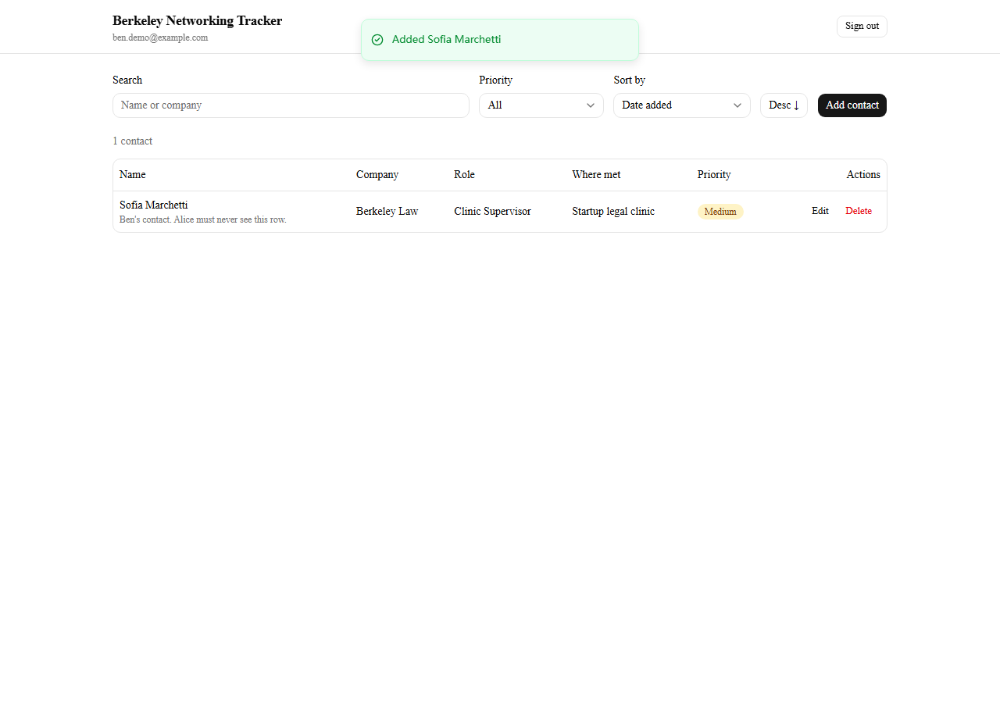

### 3. Sign-in and sign-out

| Signed out (sign-in screen) | Signed in |
| --- | --- |
|  |  |

### 4. Create, edit, delete, and refresh

| Editing | Persists across a full page reload |
| --- | --- |
|  | 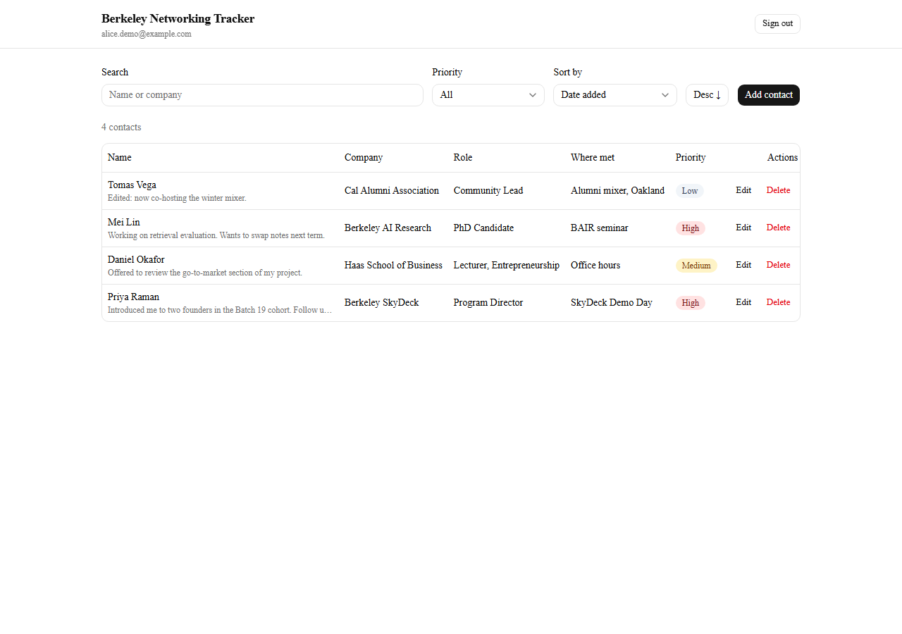 |

| Delete confirmation | After delete |
| --- | --- |
| 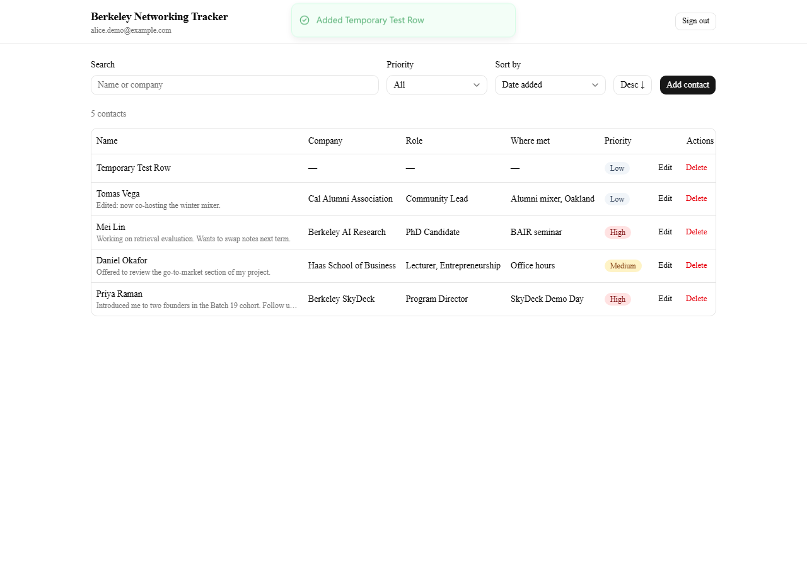 |  |

The refresh screenshot is taken after `page.reload()`, and the script waits for the *edited*
note text to reappear — so it demonstrates the edit was persisted in Postgres, not cached in
the client.

### 5. Invalid input failing safely

Submitting a whitespace-only name. The message comes from the **server's 400 response**, not
from client-side validation — the API route returns `fieldErrors: { name: "Name is required" }`
and the field renders it inline with `aria-invalid`:

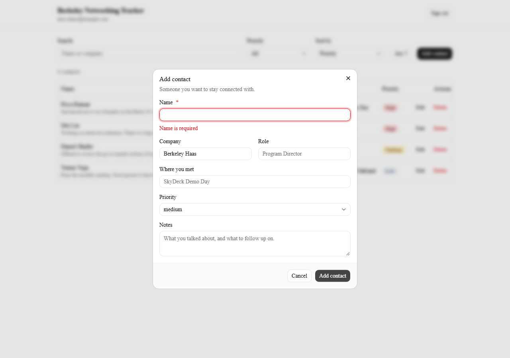

### 6. Schema and RLS ownership rule

See [Database schema](#database-schema) and
[Authentication and RLS ownership](#authentication-and-rls-ownership).

### 7. No committed secrets

`.gitignore` ignores `.env*` and then re-includes only `.env.example`; the negation is
deliberately last, because git honours the last matching pattern. Verify with the `git log -p`
command in [Environment variables](#environment-variables).

---

## Rubric traceability

| Requirement | Where | How to verify |
| --- | --- | --- |
| Live public URL | Vercel | [Live app](https://berkeley-networking-tracker-shuoran.vercel.app) |
| Frontend and backend separated | `components/` + `app/` vs `app/api/contacts/` | `lib/neon-server.ts` is imported only by route handlers |
| Design or component system | Tailwind v4 + shadcn/ui | `components/ui/`, `components.json` |
| Neon Postgres + Managed Better Auth + Data API | `lib/neon-browser.ts`, `lib/neon-server.ts` | Two-URL object form in `lib/neon-browser.ts` |
| Sign up / in / out | `components/auth-panel.tsx` | [Evidence §3](#3-sign-in-and-sign-out) |
| Contact fields incl. priority | `db/schema.sql`, `components/contact-dialog.tsx` | [Schema](#database-schema) |
| Priority only high/medium/low | Zod enum + `CHECK` constraint | `npm test` |
| Sortable list | `lib/sort-filter.ts` | [Walkthrough](#product-walkthrough) — high sorts first |
| Filter | Priority filter + name/company search | [Walkthrough](#product-walkthrough) |
| Edit and delete own contacts | `app/api/contacts/[id]/route.ts` | [Evidence §4](#4-create-edit-delete-and-refresh) |
| Survives refresh | Neon Postgres | [Evidence §4](#4-create-edit-delete-and-refresh) |
| Empty name / bad priority fail clearly | `lib/validation.ts` + CHECKs | [Evidence §5](#5-invalid-input-failing-safely) |
| Loading / empty / success / error states | `components/contacts-app.tsx` | Skeletons, empty state, toasts, retry banner |
| Web and mobile friendly | Table at `md+`, cards below | [Mobile screenshot](#product-walkthrough) |
| `user_id` text, default `auth.user_id()`, not null | `db/schema.sql` | [Schema](#database-schema) |
| RLS enabled | `db/schema.sql` | `npm run db:push` prints `Row Level Security enabled: true` |
| Separate select/insert/update/delete policies | `db/schema.sql` | Four `create policy` statements |
| Every policy restricts to the signed-in user | `db/schema.sql` | All four use `auth.user_id() = user_id` |
| Update cannot reassign ownership | `contacts_update_own` `WITH CHECK` | [Evidence §2](#2-two-account-privacy-test-the-strong-form) — HTTP 403 |
| Two accounts prove isolation | RLS | [Evidence §2](#2-two-account-privacy-test-the-strong-form) |
| Secrets stay server-only | `.gitignore`, `.env.example` | [Evidence §7](#7-no-committed-secrets) |
| At least one automated test | `tests/` | [Evidence §1](#1-automated-test-output) |

---

## Known limitations and what I'd do next

1. **No email verification or password reset.** Managed Better Auth supports both; neither is
   wired up, so a typo in an email address is unrecoverable. First thing I would add.
2. **The demo account credentials are in the repo**, in `scripts/verify-rls.mjs`. That is
   deliberate — the point of that script is that a grader can run it — and the accounts hold
   only fictional contacts. They are overridable via `RLS_USER_A_EMAIL` / `RLS_USER_A_PASSWORD`.
   In a real product those would be seeded from CI secrets instead.
3. **A direct Data API write bypasses the friendly error messages.** The `CHECK` constraints
   still hold, so nothing invalid is stored, but the caller sees a raw constraint violation.
   Deliberate: the database is the backstop, not the UX layer.
4. **The list is not paginated.** Every contact loads at once — fine for a personal network of
   tens or hundreds, but it would need `range()`-based pagination in the thousands.
5. **Search is a `LIKE` scan** over name and company. A trigram index or a `tsvector` column
   would be the right fix once the table is large.
6. **No optimistic UI.** Every write waits for the server and refetches: simple and always
   consistent, but there is a visible delay. Optimistic updates with rollback would feel faster.
7. **Notes are plain text** — no tags, formatting, or reminders. A "follow up by" date with a
   sorted "due" view is the feature I would actually want next.
8. **The Playwright script is a capture tool, not a test suite.** It asserts the one thing that
   matters (User B sees none of User A's contacts) and otherwise fails only if a selector breaks.
   Promoting it to `@playwright/test` with real assertions on each step would make the whole
   walkthrough regression-proof rather than just reproducible.
